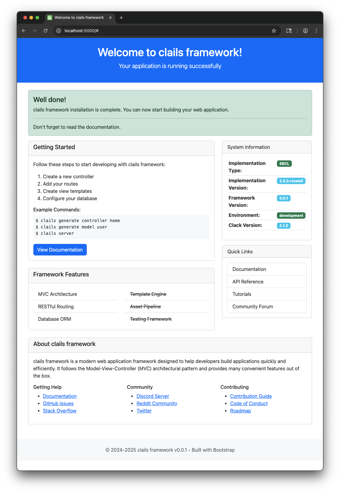
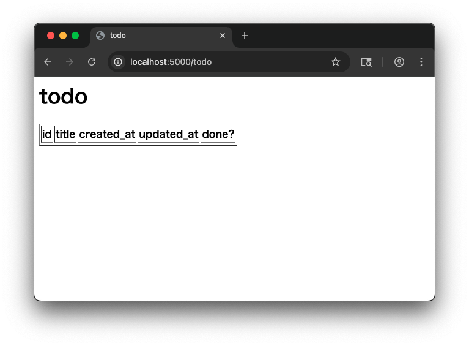
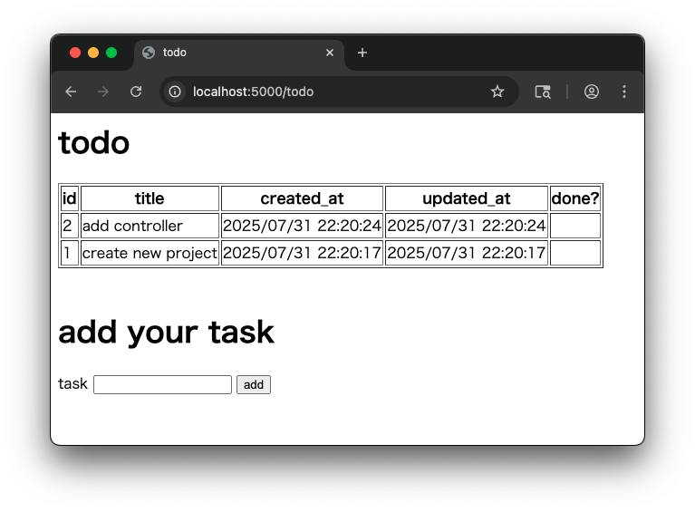

# clails

web framework inspired by Ruby on Rails

# requirement

- roswell
- qlot
- sbcl 

# install

clails is alpha version. so you will need to manually configure various settings.


**clone clails**

```bash
git clone https://github.com/tamurashingo/clails.git
```

**install dependencies**

```bash
cd clails
qlot install
```

**add environment variables**

path

```bash
export PATH=$PATH:$PWD/roswell
```

asdf's source path

```bash
export CL_SOURCE_REGISTRY=$PWD
```

# usage

## create project

```bash
clails.ros new project-name
```

### options

- `-p` <em>pathname</em> | `--path` <em>pathname</em>
    - set root directory when creating a project

- `-d` <em>database-type</em> | `--database` <em>database-type</em>
    - set database type
    - database types are
         - `sqlite3`
         - `mysql`
         - `postgresql`

## generate scaffold

generate model, view, controller and migration file.

```bash
clails.ros generate scaffold todo
```

generates

- `app/models/todo.lisp`
- `app/views/todo/show.html`
- `app/views/todo/new.html`
- `app/views/todo/edit.html`
- `app/views/todo/delete.html`
- `app/controllers/todo-controller.lisp`
- `db/migrate/yyyymmddhhmmss_todo.lisp`

## generate model, view, controller and migration

```bash
clails.ros generate model todo
clails.ros generate view todo
clails.ros generate controller todo
clails.ros generate migration todo
```

here is the command to generate all of the above files at once.

```bash
clails.ros generate scaffold todo
```

### options

- `--no-overwrite`
    - if file already exists, stop generateing.


- `-n` | `--no-migration`
    - when generating model, generate no migration files.


## create new database

execute `create database` command

```bash
clails.ros db create
```


## migrate database

```bash
clails.ros db migrate up
```

## startup server

```bash
clails.ros server
```

visit `http://localhost:5000/`

you'll see



# example

## create new project

create todo applicaton project

```bash
clails.ros new todoapp
```

## create database

```bash
cd todoapp
clails.ros db create
```


## generate model, view, controller and migration files.

```bash
clails.ros generate scaffold todo
```

edit migration file (at db/migrate/yyyymmddhhmmss_todo.lisp)

```common-lisp
; -*- mode: lisp -*-
(in-package #:todoapp/db)

(defmigration "todo"
  (:up #'(lambda (connection)
           (create-table connection :table "todo"
                                    :columns '(("title" :type :string
                                                        :not-null t)
                                               ("done" :type :boolean
                                                       :default-value 0)))
           (add-index connection :table "todo"
                                 :index "idx-title"
                                 :columns '("title")))
   :down #'(lambda (connection)
             (drop-table connection :table "todo"))))
```


## apply migration

```bash
clails.ros db migrate up
```


## edit model

add `show-all` method to model file (app/models/todo.lisp)

```common-lisp
; -*- mode: lisp -*-
(in-package #:cl-user)
(defpackage #:todoapp/models/todo
  (:use #:cl
        #:clails/model/base-model
        #:clails/model/query)
  (:export #:<todo>
           #:show-all))

(in-package #:todoapp/models/todo)

(defmodel <todo> (<base-model>)
  (:table "todo"))

(defun show-all ()
  (select '<todo> :order-by '((id :desc))))
```

## edit controller

edit todo controller (app/controllers/todo-controller.lisp).

add `records` slot and define accessor.

```common-lisp
(defclass <todo-controller> (<web-controller>)
  ((records :accessor records)))
```

in `do-get` method, fetch records and stuff it to controller.

```common-lisp
(defmethod do-get ((controller <todo-controller>))
  (setf (records controller) (show-all))
  (set-view controller "todo/show.html"))
```

the final controller code is as follows.

```common-lisp
; -*- mode: lisp -*-
(in-package #:cl-user)
(defpackage #:todoapp/controllers/todo-controller
  (:use #:cl
        #:clails/controller/base-controller)
  (:import-from #:todoapp/models/todo
                #:show-all)
  (:import-from #:clails/model/base-model
                #:ref)
  (:import-from #:clails/helper/date-helper
                #:view/datetime)
  (:import-from #:todoapp/models/todo
                #:show-all)
  (:export #:<todo-controller>))

(in-package #:todoapp/controllers/todo-controller)

(defclass <todo-controller> (<web-controller>)
  ((records :accessor records)))


(defmethod do-get ((controller <todo-controller>))
  (setf (records controller) (show-all))
  (set-view controller "todo/show.html"))

;(defmethod do-post ((controller <todo-controller>))
;  (set- view controller "todo/new.html"))

;(defmethod do-put ((controller <todo-controller>))
;  (set-view controller "todo/edit.html"))

;(defmethod do-delete ((controller <todo-controller>))
;  (set-view controller "todo/delete.html"))
```


## edit view

edit todo view (app/views/todo/show.html).

switching to the controller's package to directly reference its values from the view.

note: Please convert the value to a string when outputting it.

```html
<% in-package :todoapp/controllers/todo-controller %>
<html>
<head>
  <meta charset="utf-8">
  <title>todo</title>
</head>
<body>
  <h1>todo</h1>

  <table border="1">
    <thead>
      <tr>
        <th>id</th>
        <th>title</th>
        <th>created_at</th>
        <th>updated_at</th>
        <th>done?</th>
      </tr>
    </thead>
      <% loop for r in (records (@ controller)) do %>
        <tr>
          <td><%= (write-to-string (ref r :id)) %></td>
          <td><%= (ref r :title) %></td>
          <td><%= (view/datetime (ref r :created-at)) %></td>
          <td><%= (view/datetime (ref r :updated-at)) %></td>
          <td><%= (if (ref r :done) "done" "") %></td>
        </tr>
      <% end %>
    <tbody>
    </tbody>
  </table>

</body>
</html>
```


## run server

```bash
clails.ros server
```

visit 'http://localhost:5000/todo'

you'll see



and you'll get server log.

```
Loaded 0 system files.
WARNING:
   Deprecated recursive use of (ASDF/OPERATE:OPERATE 'ASDF/LISP-ACTION:LOAD-OP
   '("todoapp/controllers/todo-controller")) while visiting
   (ASDF/LISP-ACTION:LOAD-OP "todoapp/application" "lisp") - please use proper
   dependencies instead
Hunchentoot server is started.
Listening on 127.0.0.1:5000.
running startup hook...clails/model/connection:startup-connection-pool
debug: query: SELECT ID, CREATED_AT, UPDATED_AT, TITLE, DONE FROM todo   ORDER BY ID DESC
debug: params: NIL
```

## add post form

edit `app/views/todo/show.html` and add form to add your todo.

```diff
***************
*** 28,34 ****
--- 28,44 ----
          </tr>
        <% end %>
      </tbody>
    </table>

+   <br />
+
+   <h1>add your task</h1>
+
+   <form action="/todo" method="POST">
+     <label for="name">task</label>
+     <input type="text" name="name" id="name" required />
+     <input type="submit" value="add" />
+   </form>
+
  </body>
  </html>
```

## edit model

add save method to model.

```diff
***************
*** 3,17 ****
  (defpackage #:todoapp/models/todo
    (:use #:cl
          #:clails/model/base-model
          #:clails/model/query)
    (:export #:<todo>
!            #:show-all))

  (in-package #:todoapp/models/todo)

  (defmodel <todo> (<base-model>)
    (:table "todo"))

  (defun show-all ()
    (select '<todo> :order-by '((id :desc))))

--- 3,20 ----
  (defpackage #:todoapp/models/todo
    (:use #:cl
          #:clails/model/base-model
          #:clails/model/query)
    (:export #:<todo>
!            #:show-all
!            #:add-task))

  (in-package #:todoapp/models/todo)

  (defmodel <todo> (<base-model>)
    (:table "todo"))

  (defun show-all ()
    (select '<todo> :order-by '((id :desc))))

+ (defun add-task (taskname)
+   (save (make-record '<todo> :title taskname)))
```

## edit controller

edit `do-post`


```diff
***************
*** 8,18 ****
    (:import-from #:clails/model/base-model
                  #:ref)
    (:import-from #:clails/helper/date-helper
                  #:view/datetime)
    (:import-from #:todoapp/models/todo
!                 #:show-all)
    (:export #:<todo-controller>))

  (in-package #:todoapp/controllers/todo-controller)

  (defclass <todo-controller> (<web-controller>)
--- 8,19 ----
    (:import-from #:clails/model/base-model
                  #:ref)
    (:import-from #:clails/helper/date-helper
                  #:view/datetime)
    (:import-from #:todoapp/models/todo
!                 #:show-all
!                 #:add-task)
    (:export #:<todo-controller>))

  (in-package #:todoapp/controllers/todo-controller)

  (defclass <todo-controller> (<web-controller>)
***************
*** 21,32 ****

  (defmethod do-get ((controller <todo-controller>))
    (setf (records controller) (show-all))
    (set-view controller "todo/show.html"))

! ;(defmethod do-post ((controller <todo-controller>))
! ;  (set-view controller "todo/new.html"))

  ;(defmethod do-put ((controller <todo-controller>))
  ;  (set-view controller "todo/edit.html"))

  ;(defmethod do-delete ((controller <todo-controller>))
--- 22,35 ----

  (defmethod do-get ((controller <todo-controller>))
    (setf (records controller) (show-all))
    (set-view controller "todo/show.html"))

! (defmethod do-post ((controller <todo-controller>))
!   (add-task (gethash "name" (params controller)))
!   (setf (records controller) (show-all))
!   (set-view controller "todo/show.html"))

  ;(defmethod do-put ((controller <todo-controller>))
  ;  (set-view controller "todo/edit.html"))

  ;(defmethod do-delete ((controller <todo-controller>))
```

## run !!

run server and visit 'http://localhost:5000/todo'

you'll see



---
Copyright 2024-2025 tamura shingo
