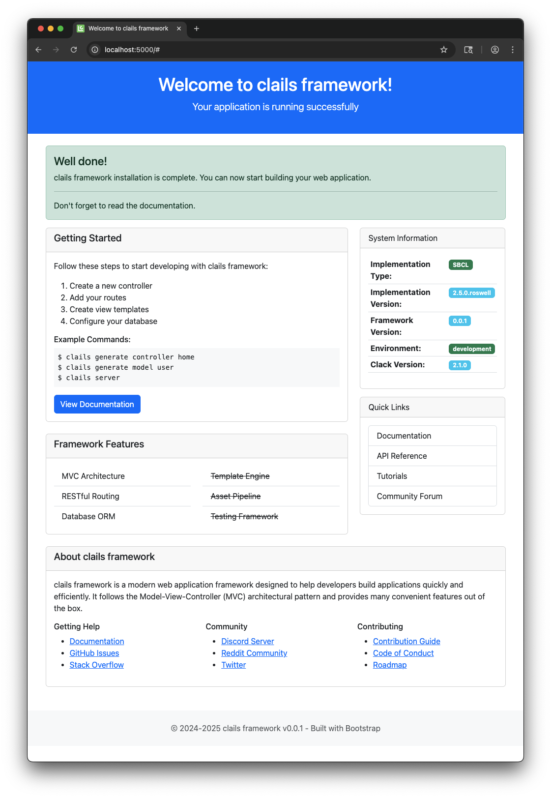

# clails

A web framework inspired by Ruby on Rails, built with Common Lisp.

## Features

- **MVC Architecture** - Model-View-Controller design pattern
- **RESTful Routing** - Rails-like routing with automatic REST resource generation
- **Active Record Pattern** - Intuitive database operations with ORM
- **Database Migrations** - Version control for database schema
- **Multiple Database Support** - SQLite3, MySQL, PostgreSQL
- **Task System** - Custom task definition and execution with dependency management
- **Template Engine** - Built-in templating for views
- **Scaffolding** - Rapid prototyping with code generation
- **Docker Support** - Ready-to-use Docker development environment
- **Swank Integration** - Remote debugging via REPL

## Requirements

- Roswell (Common Lisp implementation manager)
- SBCL (Steel Bank Common Lisp)

## Installation

### Installing Roswell

```bash
# macOS (Homebrew)
brew install roswell

# Linux
# See https://github.com/roswell/roswell/wiki/Installation
```

### Installing Required Libraries

```bash
ros install fukamachi/cl-dbi
ros install tamurashingo/cl-dbi-connection-pool
ros install tamurashingo/cl-batis
ros install tamurashingo/getcmd
```

### Installing clails

```bash
ros install tamurashingo/clails
```

To specify a specific branch or tag:

```bash
# branch
ros install tamurashingo/clails/release/0.0.2

# tag
ros install tamurashingo/clails/v0.0.2
```

### Verify Installation

```bash
clails --help
```

### Using clails via Docker (no local Roswell/SBCL required)

If you don't want to install Roswell/SBCL locally, you can build and run `clails`
as a Docker image instead. Every subcommand operates on the host's current
directory, so bind-mount it with `-v "$PWD":/workspace`:

```bash
docker build -f Dockerfile.cli -t tamurashingo/clails .
# (once published to Docker Hub, `docker pull tamurashingo/clails` will replace the build step)

docker run --rm -it -v "$PWD":/workspace tamurashingo/clails new myapp
docker run --rm -it -v "$PWD":/workspace tamurashingo/clails new myapp --database mysql
```

`generate:*`, `db:*`, `task`, `environment`, `test` and `server` work the same way,
but must be run **from inside the project directory** on the host (not its parent),
since they resolve the project from the current directory just like `new` does:

```bash
cd myapp
docker run --rm -it -v "$PWD":/workspace tamurashingo/clails generate:model todo
docker run --rm -it -v "$PWD":/workspace tamurashingo/clails db:migrate

# server needs its port published and bound to 0.0.0.0 to be reachable from the host
docker run --rm -it -v "$PWD":/workspace -p 5000:5000 tamurashingo/clails server --bind 0.0.0.0
```

The container runs as a fixed non-root user (uid/gid `1000`), so files created
under the bind mount are owned by that uid rather than root. If your host user's
uid isn't `1000`, pass `--user "$(id -u):$(id -g)"` to match your own account.

Note: `clails stop` only works when called in the same process as a running
`server` (e.g. via a connected swank REPL). Since each `docker run` starts a new
process, use Ctrl-C or `docker stop` to stop a containerized `server` instead —
both deliver SIGINT/SIGTERM, which `clails server` already handles gracefully.

## Quick Start

### Create a New Project

```bash
clails new todoapp
cd todoapp
```

### Docker Development (Recommended)

Build and start the Docker environment:

```bash
make build
make up
```

Create database and run migrations:

```bash
make db.create
make db.migrate
```

Available Make commands:
- `make build` - Build Docker image
- `make up` - Start containers
- `make down` - Stop containers
- `make console` - Open shell in container
- `make db.create` - Create database
- `make db.migrate` - Run migrations

### Local Development

Create database:

```bash
clails db:create
```

Run migrations:

```bash
clails db:migrate
```

Start server:

```bash
clails server
```

Visit `http://localhost:5000/` to see the welcome page:



## Documentation

Comprehensive guides for developing with clails:

- **[QuickStart](document/quickstart.md)** ([日本語](document/quickstart_ja.md)) - Build your first TODO application
- **[Command Guide](document/command.md)** ([日本語](document/command_ja.md)) - CLI commands reference
- **[Model Guide](document/model.md)** ([日本語](document/model_ja.md)) - Database operations, queries, transactions, and pessimistic locking
- **[Logging Guide](document/logging.md)** ([日本語](document/logging_ja.md)) - Flexible logging system with hierarchical loggers
- **[Task Guide](document/task.md)** ([日本語](document/task_ja.md)) - Custom task system with dependency management
- **[Job Queue Guide](document/job-queue.md)** ([日本語](document/job-queue_ja.md)) - DB-persisted background job queue with retry/backoff
- **[View Guide](document/view.md)** ([日本語](document/view_ja.md)) - Template engine and rendering (coming soon)
- **[Controller Guide](document/controller.md)** ([日本語](document/controller_ja.md)) - Request handling and routing (coming soon)
- **[Environment Guide](document/environment.md)** ([日本語](document/environment_ja.md)) - Configuration management (coming soon)
- **[Testing Guide](document/testing.md)** ([日本語](document/testing_ja.md)) - Testing framework (coming soon)


---
Copyright 2024-2025 tamura shingo
